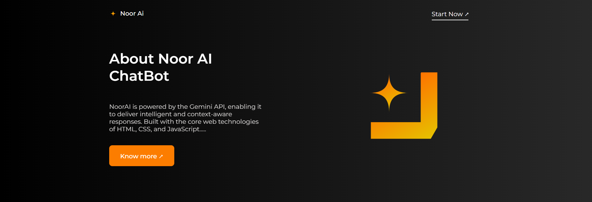
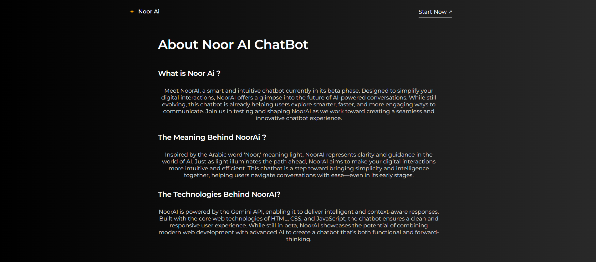

# MyNews.

This project was generated with [Angular CLI](https://github.com/angular/angular-cli) version 18.2.11.

<h2>The App without ApiKey :</h2>

<h2>The App with ApiKey :</h2>

<h2>Project Structure</h2>

mynewsapp/ 

├── src/ 
│   ├── app/ 
│   │   ├── components/       # Reusable components (e.g., header, footer, news list) 
│   │   ├── newsapi.services  # API service for fetching news data 
│   └── index.html            # App entry point 
├── angular.json              # Angular CLI configuration 
├── package.json              # Node.js dependencies 
└── tsconfig.json             # TypeScript configuration 

<h2>Technologies Used</h2>

Framework: Angular 
Language: TypeScript 
Styling: CSS, Bootstrap 
API: NewsAPI 
